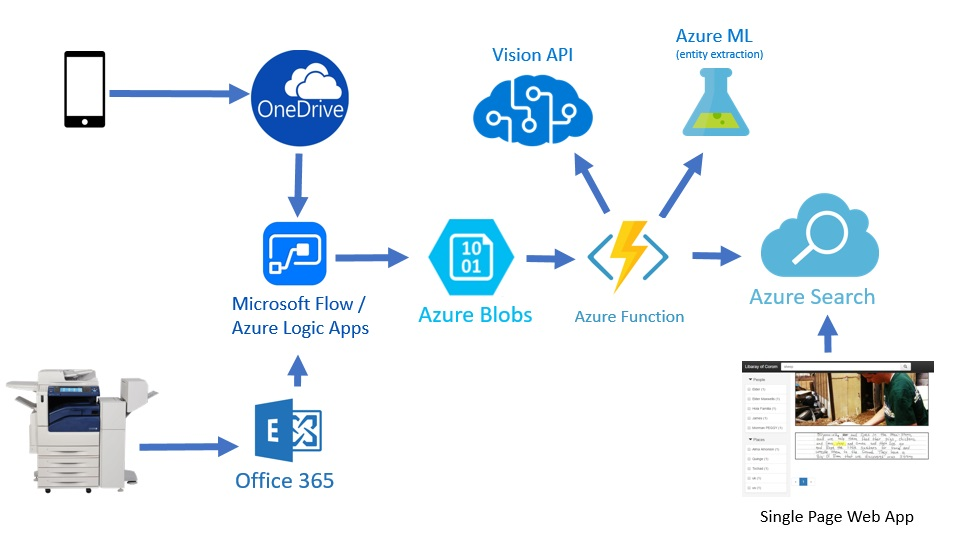
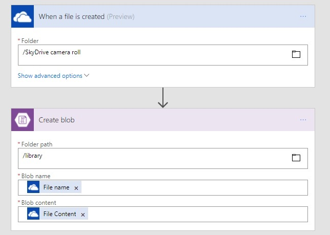
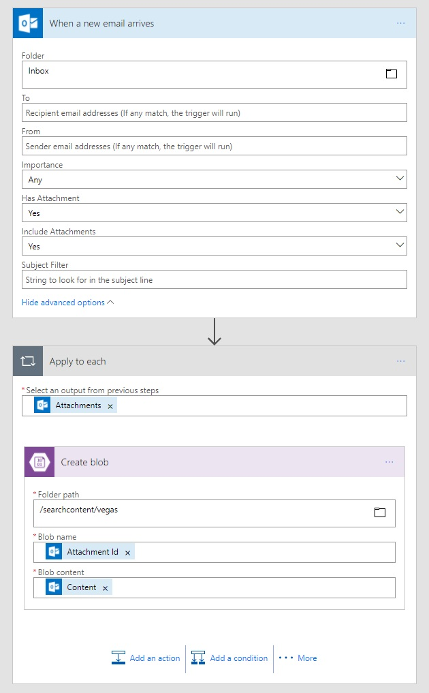

# The Library Of Corom
Create your own cognitive enriched searchable libraries in Azure for all your treasures.

You can watch the demo in action in [Joseph Sirosh Build 2017 session (@5:00)](https://channel9.msdn.com/Events/Build/2017/B8081)

## Overview
This project can be used to easily create an data enrichment pipeline that allows you to
index documents and images automaticaly from your phone, email, scanner, etc. and search
them using a Web UI.  The search index is enriched using Microsoft cognitive cabilities
which currently include:
* Handwriting / OCR (keyword search)
* Named Entity extraction (People and Places)
* Image caption and Tags
* Adult / Racy image score

## Services

The data pipeline is as follows:
1. images are captured on devices (such as a phone, scanner, etc)
2. images are uploaded to the cloud (such as OneDrive, or Office 365, Outlook.com, etc)
3. [Microsoft Flow](http://flow.microsoft.com/) (or [Azure Logic Apps](https://azure.microsoft.com/en-us/services/logic-apps/)) is configured to automatically move images from various places to [Azure blob storage](https://azure.microsoft.com/en-us/services/storage/blobs/)
4. An [Azure Function](https://azure.microsoft.com/en-us/services/functions/) triggered by the blog store and
    1. uses the [Cognitive Services Vision API](https://azure.microsoft.com/en-us/services/cognitive-services/computer-vision/) extract text information from the image
    2. and an [Azure ML webservice to extract named entities](https://gallery.cortanaintelligence.com/Experiment/Entity-Recognition-Web-Service-2) from the text (People and Places)
    3. then adds the data to the [Azure Search](https://azure.microsoft.com/en-us/services/search/) index
5. A single page Web App uses the [AzSearch.js library](https://github.com/EvanBoyle/AzSearch.js) to search to index

## Limitations
1. This is just a demo to showcase a congnitive search scenario.  It is not intended to demonstrate a scalable architecture.
2. The OCR technology is not perfect and the handwriting capability is in preview.  The results will vary greatly by scan and image quality.
2. The code currenly only processes images. Documents need to be in image format (.jpg, .png, .tiff, etc) rather than PDF or other document formats.
   Scanned documents with multiple pages should be in **multi-page TIFF** format.  Check your scanner to see if it will generate this.

## Setting up your own library

### Prerequisites
1. Azure Subscription you can access. All services can use the free teirs for this demo (with the exeption of Azure Storage)
2. A Microsoft account with access to Microsoft Flow (comes with Office 365), otherwise use Azure Logic Apps which is pretty much the same thing.
3. [Visual Studio 2015](https://www.visualstudio.com/downloads/) with [tools for Azure Functions](https://blogs.msdn.microsoft.com/webdev/2016/12/01/visual-studio-tools-for-azure-functions/) installed.
4. Basic familiarity with using the [Azure Portal](https://portal.azure.com) and cloning and compiling code from github

### Create Azure Services
> TIP: create all your Azure services in the same Resource Group and Region for best performance and managability

1. [Create Azure Search service](https://docs.microsoft.com/en-us/azure/search/search-create-service-portal) for your library.
   The free teir works well. Copy these settings that you will use later.
   1.  __Service Name__ (under the "Properties" section)
   2.  __Admin key__ (PRIMARY ADMIN KEY under "Keys" section)
   3.  __Query key__ (click Manage query keys under "Keys" section)

2. [Create Azure Blob Storage account](https://docs.microsoft.com/en-us/azure/storage/storage-create-storage-account#create-a-storage-account) for your images.
   The default values work well. Copy these settings that you will use later.
   1.  __Account Name__ (Storage account name under the "Access Keys" section)
   2.  __Account Key__ (key1 under the "Access Keys" section)

3. Create a [Azure ML Entity Recognition Web Service](https://gallery.cortanaintelligence.com/Experiment/Entity-Recognition-Web-Service-2) experiment by clicking the "Open in Studio" button.
   Using a free AzureML studio workspace for this works fine.  Then click "Setup as Web Service" button, then Run the experiment, and click "Deploy Web service" to publish it.
   Copy these settings that you will use later.
   1.  __API Key__ (API key on the "entity recognition web service" page)
   2.  __Webservice URL__ (Request URI on the page after clicking "REQUEST/RESPONSE" web service page)

4. Get a [30 day Cognitive Services Trial Key](https://azure.microsoft.com/en-us/try/cognitive-services/?api=computer-vision) for the Computer Vision API or [purchase one in the Azure Portal](https://docs.microsoft.com/en-us/azure/cognitive-services/cognitive-services-apis-create-account).
   Copy these settings that you will use later.
   1.  __API Key__ (key1 on the "your APIs" page)

### Update Code

5. Git clone or download this codebase and open the CognitiveServices.sln in Visual Studio.  The free community edition will work fine.
   Update the configuation settings constants in the *DataEnricher\EnrichFunction.cs* file where indicated with comments near the top of the file.  
   Set DataEnricher is as the default project and hit F5 to run it.  It should run without errors and create the search indexes, blob containers,
   and test your settings.  If it fails check your settings to ensure they are correct.
   

6. Open the WebUI\index.html file in Visual Studio and update the settings near the top of the file indicated in comments.
   You can test the UI by running the DataEnricher project with a command line argument that points to a folder that contains some images to upload.
   >*DataEnricher.exe c:\myimages*
   
   To run the UI right click WebUI\index.html in Visual Studio and select *View in Browser*.
   In the UI Hit enter in the search box to see all content uploaded to the library.

### Setup an Automated Pipline

7. [Create Azure Function App](https://docs.microsoft.com/en-us/azure/azure-functions/functions-create-first-azure-function#create-a-function-app) for your enricher.
   Choose a consumption plan to pay only for what you use, or create a free App Service plan that you will share with your web UI.
   Right click the EnricherFunction Project in Visual Studio and select *Publish...* then publish to the Function app you created.
   Now go to the function app in the Azure Portal and expand *Functions* and then *EnrichImages* and click *Integrate*.
   Associate the storage account with this function by clicking *new* next to the *Storage account connection*
   and select the storage account you created earlier.  Click Save.
   > You can test the function by using the [Azure Storage explorer](http://storageexplorer.com/) to upload images to the *library* blob container on your storage account.

8. Configure [Microsoft Flow](http://flow.microsoft.com/) to create blobs from images that are taken on your phone,
   sent to your email, etc.  You can also create these using Azure Logic Apps instead of Flow and they work the same way.

   This flow automatically adds the the library pictures taken on a phone that are uploaded to OnDrive.
   

   This flow automatically adds the the library pictures sent as attachments to emails send to a Outlook.com account.
   

### Publish your Web Application

9. In Visual Studio right click the WebUI project and select publish.  You can create a new Azure Web App from Visual
   studio or you can do it in the Azure portal.  This application will work well on a free app service plan,
   or you can use the same app service plan as your function app if you created one earlier.

10. You can easily customize the UI by modifying the index.html to meet your needs.  The UI is generated using the
    [AzSearch.js](https://github.com/Yahnoosh/AzSearch.js) library and it takes [very little code](https://github.com/Yahnoosh/AzSearch.js#basic-usage)
    to change what is shown in the search interface.